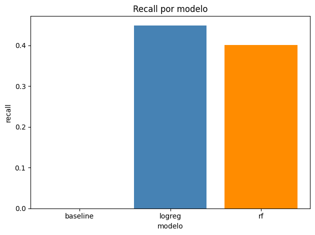

# customer-churn-ml-j-a

Prediccion de abandono de clientes (churn) — Laboratorio de Mineria de Datos (ISTEA).  
Equipo: Javier + Andrea.

Clasificacion binaria: estimar si un cliente de telecomunicaciones se va (`Churn`).

## Que hay hecho

Solo los notebooks de eda y exploracion:

1. [notebooks/01_eda.ipynb](https://github.com/javi2481/customer-churn-ml-j-a/blob/main/notebooks/01_eda.ipynb)
2. [notebooks/02_exploracion_modelos.ipynb](https://github.com/javi2481/customer-churn-ml-j-a/blob/main/notebooks/02_exploracion_modelos.ipynb)

El resto de la estructura esta creada vacia, para ir completando (src, DVC, MLflow).

## Que modelo elegimos

Comparamos tres modelos en el test (particion 80/20, semilla 42).

Nos importa sobre todo el **recall** (cuantos clientes que se van logra detectar el modelo)

| modelo | accuracy | precision | recall | f1 | roc_auc |
|---|---:|---:|---:|---:|---:|
| baseline | 0.736 | 0.000 | 0.000 | 0.000 | 0.500 |
| logreg | 0.794 | 0.663 | 0.449 | 0.535 | 0.812 |
| rf | 0.783 | 0.642 | 0.401 | 0.493 | 0.790 |



**Elegimos la regresion logistica (logreg).**

- El baseline siempre predice “no se va”. Como la mayoria de clientes se queda, acierta ~74% (accuracy alta), pero su recall es 0: no detecta ningun abandono. Por eso mirar solo accuracy no sirve.
- Logreg mejora recall, F1 y ROC-AUC respecto del baseline.
- Random Forest queda cerca, pero con peor recall que logreg.

El detalle (graficos y matriz) esta en [02_exploracion_modelos.ipynb](https://github.com/javi2481/customer-churn-ml-j-a/blob/main/notebooks/02_exploracion_modelos.ipynb).

## Estructura

```text
customer-churn-ml-j-a/
├── data/raw/            # csv historico
├── notebooks/
│   └── figuras/         # graficos de la exploracion
├── src/
│   ├── data/
│   ├── features/
│   ├── training/
│   ├── evaluation/
│   └── inference/
├── app/
├── tests/
├── monitoring/
├── models/
├── scripts/
├── .github/
├── Dockerfile
├── compose.yaml
├── requirements.txt
├── .gitignore
├── .dockerignore
└── README.md
```

## Dataset

`data/raw/customer_churn_historical.csv`
